```
##Single curve
python find_curve.py covid-cases-by-source.csv india.csv india

##Mltiple Curves
#Generate the data
cd data
python ../split.py covid_confirmed_usafacts.csv

#Generate the plots
ls data/*|cut -d "/" -f 2|sort -n|cut -d "." -f 1|tail -n 20|xargs -I % python find_curve.py covid-cases-by-source.csv data/%.csv plot/%

#Update the README
cd plot
ls |sort -n -r |grep png|xargs -I % echo '' >> ../README.md 
```
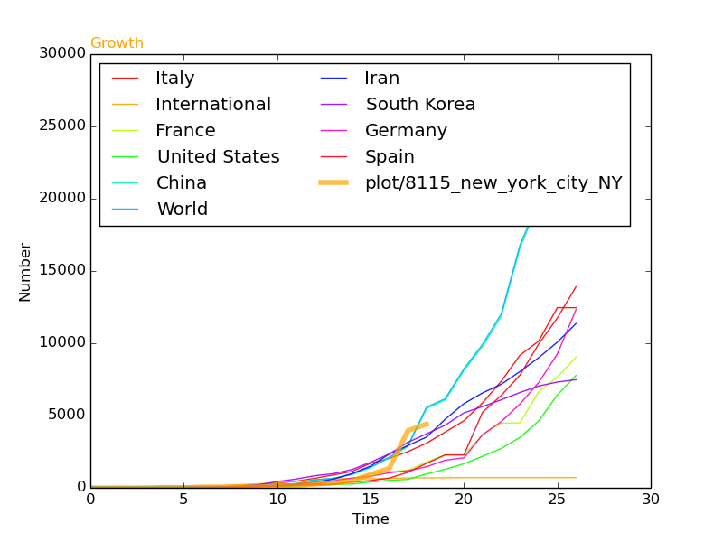
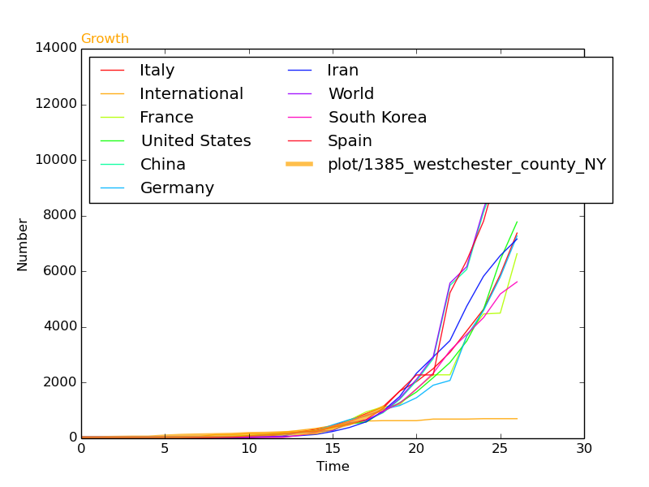
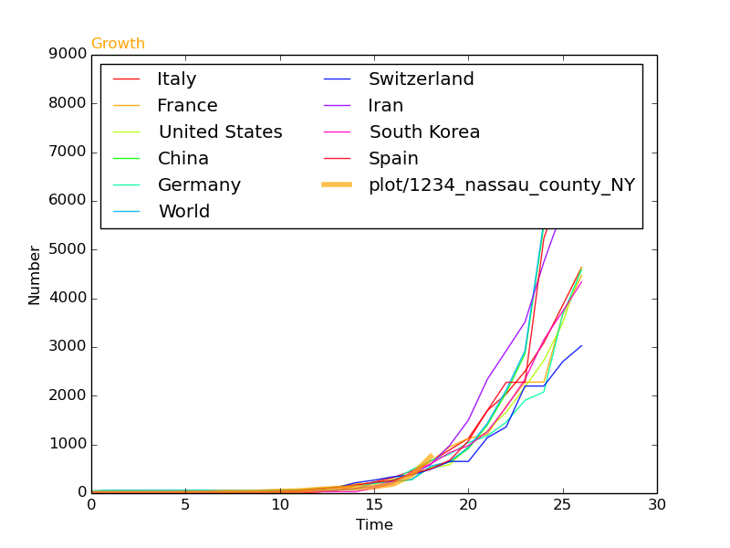
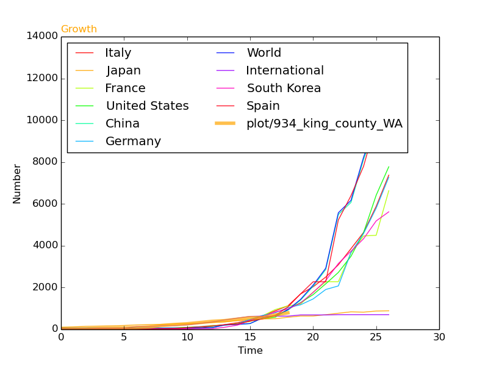
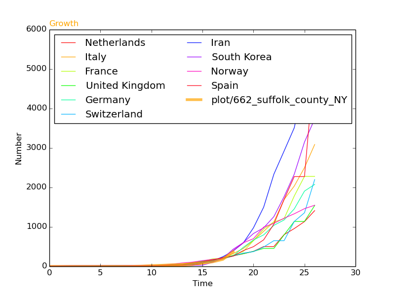
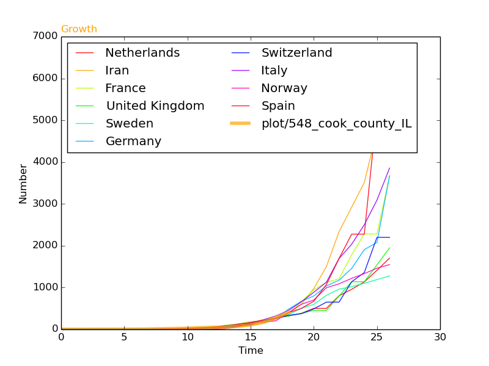
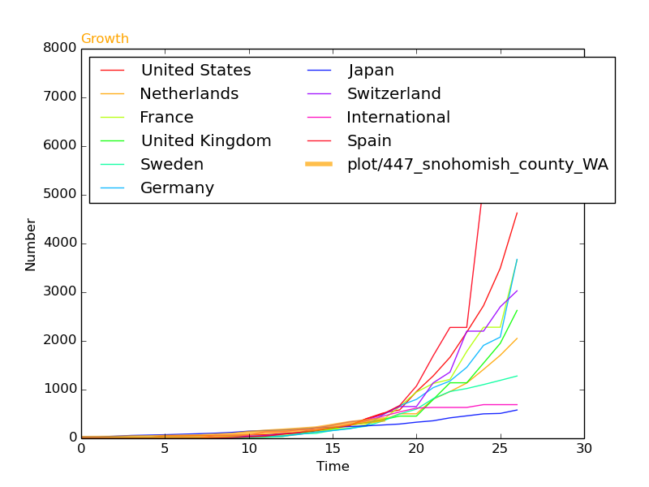
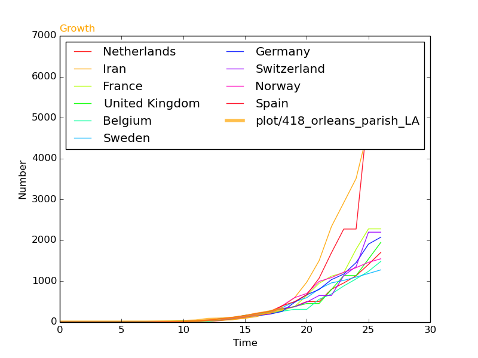
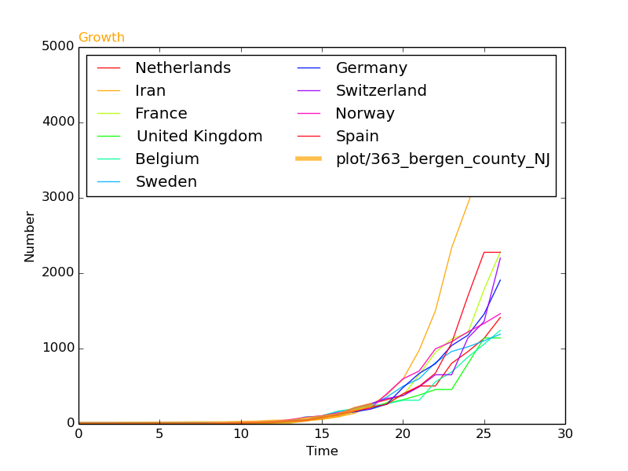
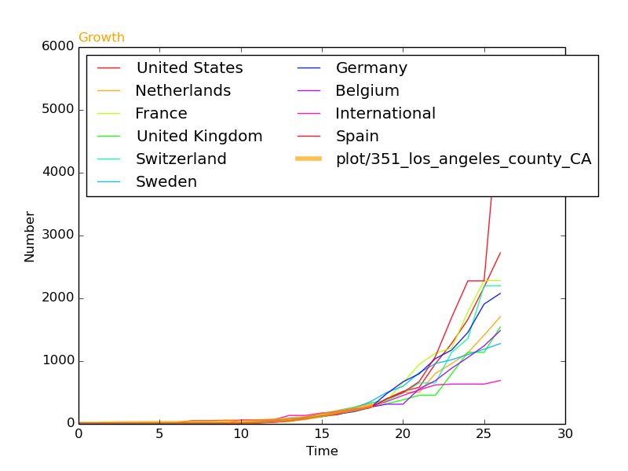
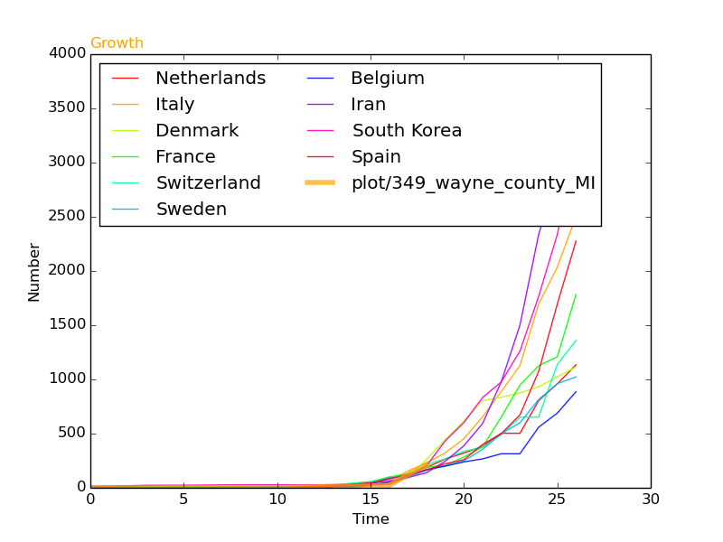
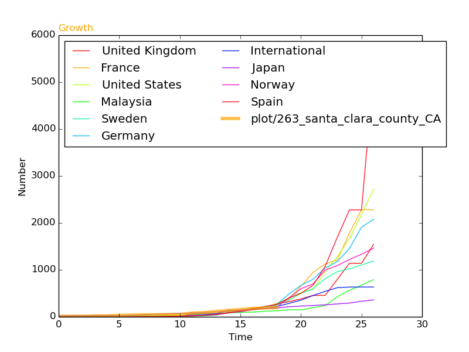
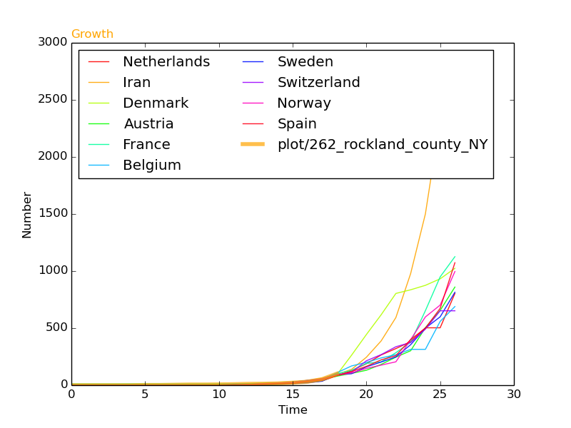
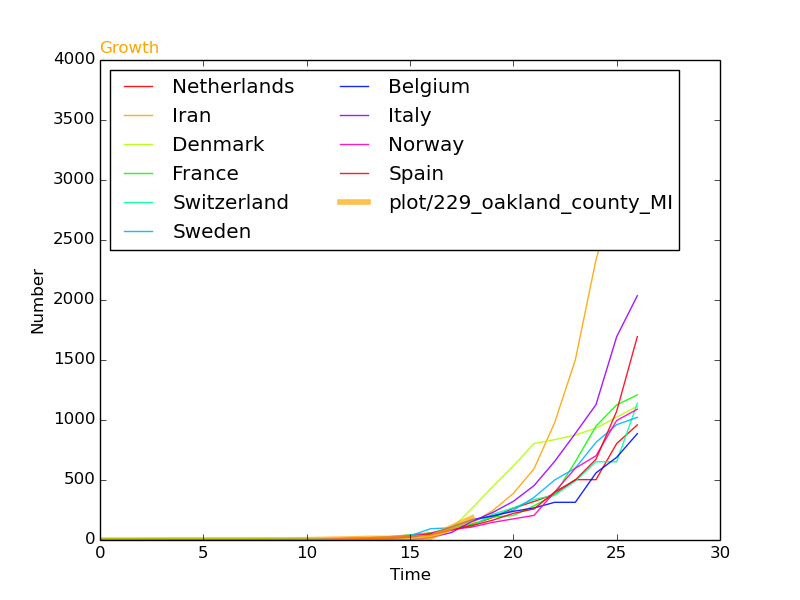
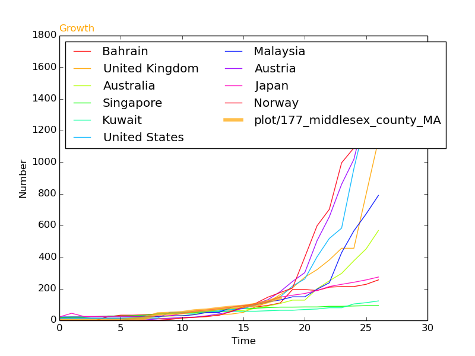
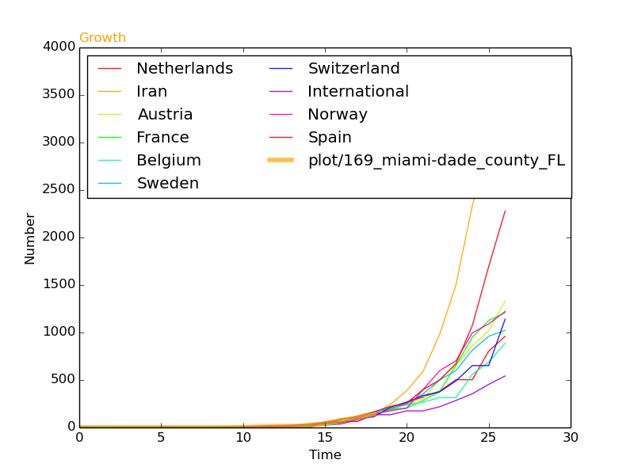
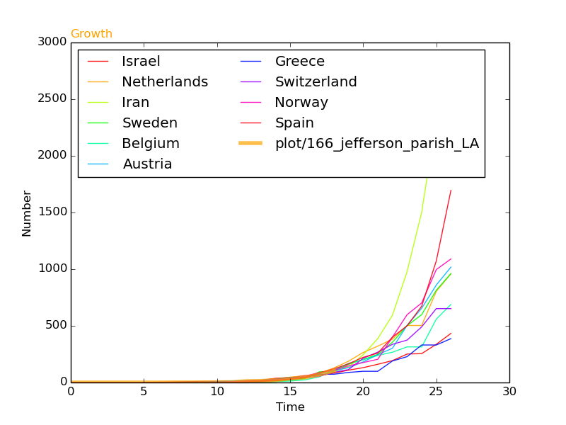
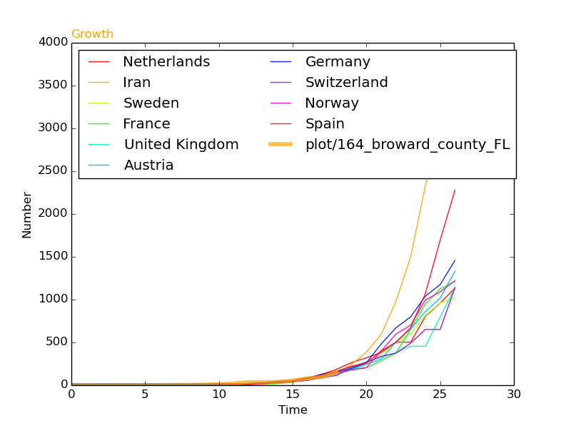
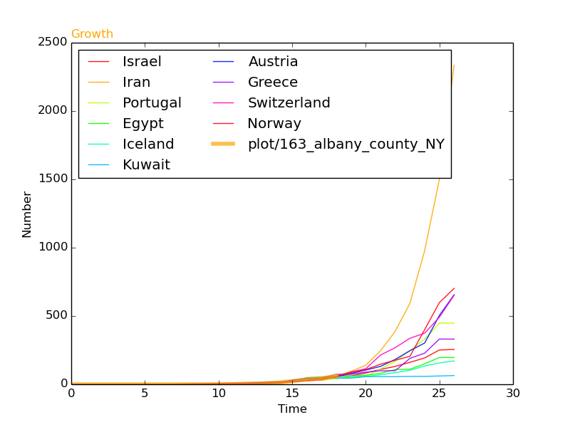
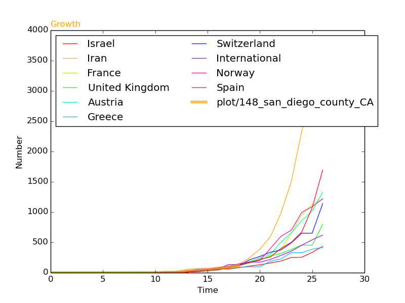
